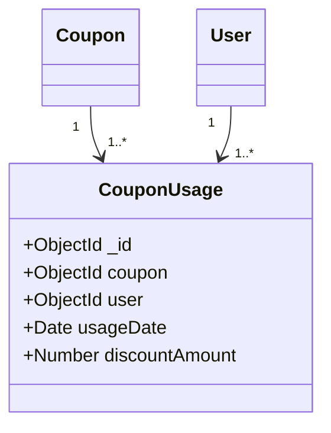

# Software Requirements Specification (SRS) for DanDun-backend

### 1. Introduction

#### 1.1 Purpose

The purpose of this document is to provide a comprehensive description of the software requirements for the DanDun-backend project. This document is intended for use by the development team, testers, project managers, and stakeholders to understand the functionalities, constraints, and design considerations of the backend system.

#### 1.2 Scope

The DanDun-backend is a crucial component of the DanDun e-commerce platform, which includes mobile applications for vendors and users, as well as an admin panel. The backend system manages all data interactions and business logic, including user authentication, vendor management, product listings, order processing, subscription management, chat functionality, and detailed analytics for administrative use.

#### 1.3 Definitions, Acronyms, and Abbreviations

- **API**: Application Programming Interface
- **JWT**: JSON Web Token
- **CRUD**: Create, Read, Update, Delete
- **DB**: Database
- **UI**: User Interface
- **HTTP**: Hypertext Transfer Protocol
- **HTTPS**: Hypertext Transfer Protocol Secure

#### 1.4 References

- Node.js Documentation: [https://nodejs.org/en/docs/](https://nodejs.org/en/docs/)
- Express.js Documentation: [https://expressjs.com/](https://expressjs.com/)
- MongoDB Documentation: [https://docs.mongodb.com/](https://docs.mongodb.com/)
- Swagger Documentation: [https://swagger.io/docs/](https://swagger.io/docs/)
- GitHub Repository: [https://github.com/brijk20/DanDun-backend](https://github.com/brijk20/DanDun-backend)

### 2. Overall Description

#### 2.1 Product Perspective

The DanDun-backend is a server-side application that acts as the backbone of the DanDun e-commerce platform. It interacts with front-end applications for vendors and users, as well as an admin panel, through RESTful APIs. The backend is responsible for managing all the data and business logic required for the smooth operation of the platform.

#### 2.2 Product Functions

The primary functions of the DanDun-backend include:

- **User Management**: Registration, login, profile management, and authentication.
- **Vendor Management**: Registration, profile management, subscription management, and product listings.
- **Product Management**: CRUD operations for products, including categories and subcategories.
- **Order Management**: Order creation, updating, tracking, and cancellation.
- **Subscription Management**: Handling vendor subscriptions and payments.
- **Chat Functionality**: Enabling real-time communication between vendors and users.
- **Analytics**: Providing detailed data and insights for admin users.
- **Notifications**: Managing notifications for users and vendors.
- **Coupon Management**: Handling discounts and coupon codes.
- **Payment Processing**: Secure handling of payments and payouts.

#### 2.3 User Classes and Characteristics

- **End Users**: Individuals who browse, purchase products, and manage their orders.
- **Vendors**: Businesses that list products for sale, manage orders, and communicate with customers.
- **Administrators**: Manage users, vendors, products, and oversee the platform's operations and analytics.

#### 2.4 Operating Environment

- **Server**: Node.js runtime environment
- **Database**: MongoDB
- **Hosting**: Cloud services like AWS, Azure, or Heroku

#### 2.5 Design and Implementation Constraints

- **Security**: Must comply with security best practices for handling user data and payments.
- **Scalability**: Designed to handle a large number of concurrent users and transactions.
- **Reliability**: Ensuring high availability and minimal downtime.

#### 2.6 Assumptions and Dependencies

- **Internet Access**: Users and vendors need access to the internet and compatible devices.
- **Third-Party Services**: Dependence on external services for payment processing and notifications.

### 3. External Interface Requirements

#### 3.1 User Interfaces

- **API Endpoints**: Accessible through HTTP/HTTPS requests.
- **Swagger UI**: For API documentation and testing.

#### 3.2 Hardware Interfaces

- **Servers**: Interface with storage devices for data persistence.

#### 3.3 Software Interfaces

- **Node.js**: Server environment
- **Express.js**: Web framework
- **MongoDB**: Database
- **Swagger**: API documentation

#### 3.4 Communication Interfaces

- **HTTP/HTTPS**: For secure communication between clients and server.
- **WebSockets**: For real-time communication (if implemented).

### 4. System Features

#### 4.1 User Management

##### 4.1.1 Registration

- **Description**: Allows new users to register.
- **Inputs**: User details (name, email, password).
- **Processing**: Validates and stores user data in the database.
- **Outputs**: Success or failure message.

##### 4.1.2 Login

- **Description**: Allows users to log in.
- **Inputs**: Email, password.
- **Processing**: Authenticates user and generates a JWT token.
- **Outputs**: JWT token for authenticated sessions.

##### 4.1.3 Profile Management

- **Description**: Allows users to update their profiles.
- **Inputs**: Profile data (name, email, password, etc.).
- **Processing**: Validates and updates user data.
- **Outputs**: Success or failure message.

#### 4.2 Vendor Management

##### 4.2.1 Registration

- **Description**: Allows new vendors to register.
- **Inputs**: Vendor details (business name, email, category, etc.).
- **Processing**: Validates and stores vendor data in the database.
- **Outputs**: Success or failure message.

##### 4.2.2 Subscription Management

- **Description**: Handles vendor subscriptions.
- **Inputs**: Subscription details (category, start date, end date, etc.).
- **Processing**: Validates and updates subscription data.
- **Outputs**: Success or failure message.

#### 4.3 Product Management

##### 4.3.1 Create Product

- **Description**: Allows vendors to create new products.
- **Inputs**: Product details (name, description, price, category, images, etc.).
- **Processing**: Validates and stores product data.
- **Outputs**: Success or failure message.

##### 4.3.2 Update Product

- **Description**: Allows vendors to update existing products.
- **Inputs**: Updated product details.
- **Processing**: Validates and updates product data.
- **Outputs**: Success or failure message.

#### 4.4 Order Management

##### 4.4.1 Create Order

- **Description**: Allows users to create new orders.
- **Inputs**: Order details (products, quantities, shipping address, payment method, etc.).
- **Processing**: Validates and stores order data.
- **Outputs**: Success or failure message.

##### 4.4.2 Track Order

- **Description**: Allows users to track their orders.
- **Inputs**: Order ID.
- **Processing**: Fetches and displays the current order status.
- **Outputs**: Order status.

#### 4.5 Analytics

##### 4.5.1 User Analytics

- **Description**: Provides insights into user activities.
- **Inputs**: None.
- **Processing**: Analyzes user data and generates reports.
- **Outputs**: Analytical reports.

##### 4.5.2 Sales Analytics

- **Description**: Provides insights into sales performance.
- **Inputs**: None.
- **Processing**: Analyzes sales data and generates reports.
- **Outputs**: Analytical reports.

#### 4.6 Notifications

##### 4.6.1 Send Notification

- **Description**: Sends notifications to users and vendors.
- **Inputs**: Notification details (message, recipient, etc.).
- **Processing**: Validates and sends notifications.
- **Outputs**: Success or failure message.

#### 4.7 Coupon Management

##### 4.7.1 Create Coupon

- **Description**: Allows admins to create new coupons.
- **Inputs**: Coupon details (code, discount, expiry date, etc.).
- **Processing**: Validates and stores coupon data.
- **Outputs**: Success or failure message.

#### 4.8 Chat Functionality

##### 4.8.1 User-Vendor Chat

- **Description**: Enables real-time communication between users and vendors.
- **Inputs**: Message details (sender, recipient, content, timestamp).
- **Processing**: Validates and stores chat messages.
- **Outputs**: Success or failure message.

#### 4.9 Payment Processing

##### 4.9.1 Handle Payments

- **Description**: Processes payments for orders.
- **Inputs**: Payment details (amount, payment method, transaction ID, etc.).
- **Processing**: Validates and processes the payment.
- **Outputs**: Success or failure message.

##### 4.9.2 Handle Payouts

- **Description**: Processes payouts for vendors.
- **Inputs**: Payout details (vendor ID, amount, bank details, etc.).
- **Processing**: Validates and processes the payout.
- **Outputs**: Success or failure message.

### 5. Non-functional Requirements

#### 5.1 Performance Requirements

- **Concurrent Users**: The system should support at least 1000 concurrent users without performance degradation.
- **Response Time**: API response time should not exceed 2 seconds under normal load conditions.
- **Throughput**: The system should handle at least 500 transactions per second.

#### 5.2 Security Requirements

- **Authentication**: Use JWT for secure user authentication.
- **Data Encryption**: Encrypt sensitive data such as passwords using bcrypt and secure communications using HTTPS.
- **Role-Based Access Control (RBAC)**: Implement RBAC to ensure users, vendors, and administrators have appropriate access rights.

#### 5.3 Reliability Requirements

- **Uptime**: The system should have an uptime of at least 99.9%.
- **Error Handling**: The system should gracefully handle errors and provide meaningful error messages.
- **Data Backup**: Regular data backups should be performed to prevent data loss.

#### 5.4 Maintainability Requirements

- **Code Quality**: Follow industry best practices for code readability, modularity, and documentation.
- **Version Control**: Use Git for version control, with clear commit messages and branching strategies.
- **Testing**: Implement unit tests, integration tests, and end-to-end tests to ensure system reliability.

#### 5.5 Scalability Requirements

- **Horizontal Scaling**: The system should support horizontal scaling to handle increased load.
- **Database Sharding**: Implement database sharding to manage large datasets efficiently.
- **Load Balancing**: Use load balancers to distribute traffic evenly across multiple servers.

#### 5.6 Usability Requirements

- **API Documentation**: Provide comprehensive API documentation using Swagger UI.
- **Error Messages**: Provide clear and actionable error messages to users and developers.
- **Logs**: Maintain detailed logs for debugging and monitoring purposes.

### 6. Appendices

#### 6.1 Glossary

- **API**: A set of functions and procedures allowing the creation of applications that access the features or data of an operating system, application, or other service.
- **JWT**: A compact, URL-safe means of representing claims to be transferred between two parties.
- **RBAC**: Role-Based Access Control, a method of regulating access to resources based on the roles of individual users.
- **CRUD**: Create, Read, Update, Delete, basic operations for database management.
- **HTTPS**: Hypertext Transfer Protocol Secure, an extension of HTTP for secure communication over a computer network.

#### 6.2 References

- Node.js Documentation: [https://nodejs.org/en/docs/](https://nodejs.org/en/docs/)
- Express.js Documentation: [https://expressjs.com/](https://expressjs.com/)
- MongoDB Documentation: [https://docs.mongodb.com/](https://docs.mongodb.com/)
- Swagger Documentation: [https://swagger.io/docs/](https://swagger.io/docs/)
- GitHub Repository: [https://github.com/brijk20/DanDun-backend](https://github.com/brijk20/DanDun-backend)

## Detailed Use Cases

### Use Case 1: User Registration

**Actors**: New User

**Preconditions**: The user is not registered on the platform.

**Description**:

1. The user navigates to the registration page.
2. The user enters their name, email, and password.
3. The user submits the registration form.
4. The system validates the input data.
5. The system creates a new user record in the database.
6. The system sends a confirmation email to the user.
7. The user receives a success message.

**Postconditions**: The user is registered and can log in to the platform.

### Use Case 2: Vendor Product Listing

**Actors**: Vendor

**Preconditions**: The vendor is registered and logged in.

**Description**:

1. The vendor navigates to the product listing page.
2. The vendor enters product details (name, description, price, category, subcategory, images, etc.).
3. The vendor submits the product listing form.
4. The system validates the input data.
5. The system creates a new product record in the database.
6. The system sends a success message to the vendor.

**Postconditions**: The product is listed on the platform and visible to users.

### Use Case 3: User Places an Order

**Actors**: User

**Preconditions**: The user is registered and logged in. The user has added products to the cart.

**Description**:

1. The user navigates to the checkout page.
2. The user enters shipping and payment details.
3. The user submits the order form.
4. The system validates the input data.
5. The system processes the payment.
6. The system creates a new order record in the database.
7. The system sends an order confirmation email to the user.
8. The user receives a success message.

**Postconditions**: The order is placed and the user can track the order status.

### Use Case 4: Admin Manages Users

**Actors**: Admin

**Preconditions**: The admin is logged in.

**Description**:

1. The admin navigates to the user management page.
2. The admin views a list of registered users.
3. The admin selects a user to view detailed information.
4. The admin can update user details or deactivate the user account.
5. The system validates the input data.
6. The system updates the user record in the database.
7. The admin receives a success message.

**Postconditions**: The user information is updated, and any necessary actions are performed.

## Data Flow Diagrams

### 1. User Registration Process

### 2. Product Listing Process

### 3. Order Placement Process

### 4. Admin User Management

## Detailed Class Diagrams

### 1. User and Vendor Class Diagram

### 2. Product and Order Class Diagram

### 3. Payment and Payout Class Diagram

### 4. Subscription and Coupon Class Diagram

### 5. Address and User Activity Class Diagram

## Detailed Data Validation Rules

### 1. User Model

#### Registration and Profile Update

- **Name**: Required, String, Min length 2, Max length 50
- **Email**: Required, String, Valid email format, Unique
- **Password**: Required, String, Min length 8
- **PhoneNumber**: Required, String, Valid phone number format
- **Role**: Required, String, Enum [‘user’, ‘vendor’, ‘admin’]
- **ProfileImageUrl**: Optional, String, Valid URL format

### 2. Vendor Model

#### Registration and Profile Update

- **User**: Required, ObjectId, Valid user reference, Unique
- **Category**: Required, ObjectId, Valid category reference
- **BusinessName**: Required, String, Min length 2, Max length 100
- **BusinessAddress**: Required, String, Min length 10, Max length 200
- **Description**: Required, String, Min length 10, Max length 500
- **LogoUrl**: Optional, String, Valid URL format
- **Status**: Required, String, Enum [‘active’, ‘inactive’]

### 3. Product Model

#### Create and Update

- **Name**: Required, String, Min length 2, Max length 100
- **Vendor**: Required, ObjectId, Valid vendor reference
- **Category**: Required, ObjectId, Valid category reference
- **Subcategory**: Required, ObjectId, Valid subcategory reference
- **Tags**: Optional, Array of strings
- **Price**: Required, Number, Min value 0
- **MinimumOrderQuantity**: Required, Number, Min value 1
- **Stock**: Required, Number, Min value 0
- **Description**: Required, String, Min length 10, Max length 1000
- **Images**: Required, Array of strings, Each item valid URL format
- **Rating**: Optional, Number, Min value 0, Max value 5

### 4. Order Model

#### Create and Update

- **User**: Required, ObjectId, Valid user reference
- **Vendor**: Required, ObjectId, Valid vendor reference
- **Products**: Required, Array of OrderItem
  - **OrderItem**
    - **Product**: Required, ObjectId, Valid product reference
    - **Quantity**: Required, Number, Min value 1
    - **Price**: Required, Number, Min value 0
- **TotalAmount**: Required, Number, Min value 0
- **Status**: Required, String, Enum [‘pending’, ‘completed’, ‘canceled’, ‘in transit’, ‘returned’]

### 5. Payment Model

#### Create and Update

- **Vendor**: Required, ObjectId, Valid vendor reference
- **Amount**: Required, Number, Min value 0
- **Date**: Required, Date, Default current date
- **Payout**: Required, ObjectId, Valid payout reference
- **TransactionDetails**: Optional, String, Max length 500
- **Status**: Required, String, Enum [‘processing’, ‘completed’, ‘failed’]

### 6. Subscription Model

#### Create and Update

- **Vendor**: Required, ObjectId, Valid vendor reference
- **Category**: Required, ObjectId, Valid category reference
- **StartDate**: Required, Date
- **EndDate**: Required, Date
- **Status**: Required, String, Enum [‘active’, ‘expired’]

### 7. Coupon Model

#### Create and Update

- **Code**: Required, String, Min length 2, Max length 20, Unique
- **Discount**: Required, Number, Min value 0, Max value 100
- **ExpiryDate**: Required, Date
- **Description**: Optional, String, Max length 500
- **Vendor**: Required, ObjectId, Valid vendor reference
- **ApplicableProducts**: Optional, Array of ObjectId, Valid product references
- **IsActive**: Required, Boolean

### 8. Address Model

#### Create and Update

- **User**: Required, ObjectId, Valid user reference
- **Name**: Required, String, Min length 2, Max length 50
- **PhoneNumber**: Required, String, Valid phone number format
- **AddressLine1**: Required, String, Min length 10, Max length 100
- **AddressLine2**: Optional, String, Max length 100
- **City**: Required, String, Min length 2, Max length 50
- **State**: Required, String, Min length 2, Max length 50
- **PostalCode**: Required, String, Valid postal code format
- **Country**: Required, String, Min length 2, Max length 50

### 9. User Activity Model

#### Log Activity

- **User**: Required, ObjectId, Valid user reference
- **Action**: Required, String, Min length 2, Max length 50
- **Details**: Required, String, Min length 2, Max length 500
- **Timestamp**: Required, Date, Default current date

---

### Analytics for Coupon Usage

#### 1. Usage Analytics

- **Total Coupons Used**: Number of times each coupon code has been used.
- **Unique Users**: Number of unique users who have used each coupon code.
- **Discount Given**: Total amount of discount given per coupon code.
- **Conversion Rate**: Percentage of users who applied the coupon code and completed a purchase.

#### 2. Analytics Data Model

### API Endpoints for Analytics

#### 1. Coupon Usage Analytics

##### Get Coupon Usage Analytics

- **URL**: `/api/analytics/coupon-usage`
- **Method**: `GET`
- **Headers**: `Authorization: Bearer <JWT>`
- **Query Parameters**: `couponCode`
- **Response**:
  - `totalCouponsUsed`: Number
  - `uniqueUsers`: Number
  - `discountGiven`: Number
  - `conversionRate`: Number
